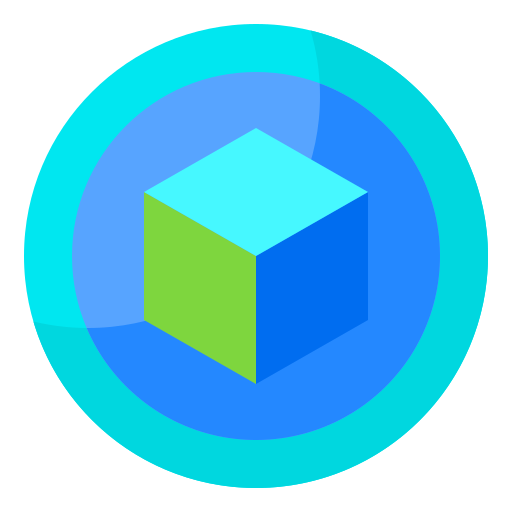

<div align="center" id="top"> 
  

&#xa0;

<a href="http://nft-langing.vercel.app/">Demo</a>

</div>

<h1 align="center">NFT-Market</h1>

<p align="center">
  
  
  
  
  
  
</p>

<p align="center">
  <a href="#dart-about">About</a> &#xa0; | &#xa0; 
  <a href="#sparkles-features">Features</a> &#xa0; | &#xa0;
  <a href="#rocket-technologies">Technologies</a> &#xa0; | &#xa0;
  <a href="#white_check_mark-requirements">Requirements</a> &#xa0; | &#xa0;
  <a href="#checkered_flag-starting">Starting</a> &#xa0; | &#xa0;
  <a href="#memo-license">License</a> &#xa0; | &#xa0;
  <a href="https://github.com/tia-cin" target="_blank">Author</a>
</p>

<br>

## 📌 About

Ultimate destination for digital art enthusiasts and collectors. Discover and own unique digital assets from creators around the world.
Find your next one-of-a-kind digital asset and add it to your collection. 
If you're a creator, showcase your digital creations and earn money by selling them on our platform. 

## ✨ Features

- Homepage Banner: Discover and own unique digital assets from creators around the world.

- Featured NFT: Check out this one-of-a-kind digital artwork from a talented artist.

- Trending NFTs: See what's hot in the NFT market right now.

- Sell Your NFTs: Showcase your digital creations and earn money by selling them on our platform.

- NFT Categories: Browse NFTs by category, including art, music, gaming, and more.

- Buy NFTs: Find your next unique digital asset and add it to your collection.

- Create Your NFT: Use our easy-to-use tools to create your own digital masterpiece and sell it on our platform.

- NFT Auctions: Bid on exclusive NFTs and be the only one to own them.

- NFT Marketplace: Join our vibrant community of NFT enthusiasts and discover the next big thing in the digital art world.

## 🚀 Technologies

The following tools were used in this project:

- [React-Native](https://reactnative.dev/)
- [Redux](https://redux.org/)
- [TypeScript](https://www.typescriptlang.org/)
- [Tailwind CSS](https://tailwindcss.com/)
- [Expo](https://expo.dev/)

## ✔️ Requirements

Before starting ❗, you need to have [Git](https://git-scm.com) and [Node](https://nodejs.org/en/) installed.

## 🚩 Starting

```bash
# Clone this project
$ git clone https://github.com/tia-cin/dictionary

# Access
$ cd dictionary

# Install dependencies
$ yarn

# Run the project
$ yarn start

# The server will initialize in the <http://localhost:3000>
```

Made with 💛 by <a href="https://github.com/tia-cin" target="_blank">Cintia Arce</a>

&#xa0;

<a href="#top">Back to top</a>
